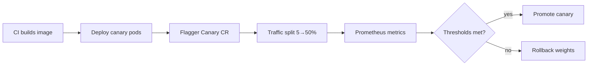

Shipping a new agent orchestrator version feels routine until the canary starts burning 40% more tokens per session and nobody notices for twenty minutes. Manual canary checks do not scale when releases happen daily and quality regressions show up in cost dashboards before error rates move. [Flagger](https://flagger.app/)—the progressive delivery controller originally built at Weaveworks—automates the promote-or-rollback decision by comparing metrics between primary and canary pods during a controlled traffic shift.

This post is a practical guide to running Flagger against agent services: which metrics matter, how to structure Canary CRDs, and where automated analysis breaks down for non-deterministic LLM outputs.

## Flagger in the agent deployment stack

A typical agent service runs as a Kubernetes Deployment behind a service mesh or ingress controller. Without Flagger, teams either big-bang deploy (risky) or manually shift Istio VirtualService weights while staring at Grafana (error-prone). Flagger closes the loop:



Flagger owns the iteration loop: increase weight, wait analysis interval, check metrics, repeat or abort. Your CI pipeline only needs to update the Deployment image tag; Flagger handles the rest via GitOps (Flux) or direct cluster watches.

## Defining a Canary resource for agent workloads

Below is a representative `Canary` manifest for an agent API deployed with Istio. Adjust service names and metric queries to your observability stack.

```yaml
# flagger/canary-agent-orchestrator.yaml
apiVersion: flagger.app/v1beta1
kind: Canary
metadata:
  name: agent-orchestrator
  namespace: agents
spec:
  targetRef:
    apiVersion: apps/v1
    kind: Deployment
    name: agent-orchestrator
  service:
    port: 8080
    targetPort: 8080
    gateways:
      - public-gateway
    hosts:
      - agent-api.internal.example
  analysis:
    interval: 2m
    threshold: 5          # max failed metric checks before rollback
    maxWeight: 50
    stepWeight: 10
    metrics:
      - name: request-success-rate
        templateRef:
          name: agent-success-rate
          namespace: agents
        thresholdRange:
          min: 99
        interval: 1m
      - name: request-duration
        templateRef:
          name: agent-latency-p95
          namespace: agents
        thresholdRange:
          max: 2500        # ms; agent p95 SLO
        interval: 1m
      - name: token-cost-ratio
        templateRef:
          name: agent-token-ratio
          namespace: agents
        thresholdRange:
          max: 110           # canary ≤ 110% of primary token cost
        interval: 2m
    webhooks:
      - name: offline-eval-gate
        type: rollout
        url: http://eval-runner.agents.svc/eval/canary
        timeout: 5m
        metadata:
          model: gpt-4o-mini-eval-set-v3
```

The `MetricTemplate` objects referenced above contain PromQL that compares canary vs primary:

```yaml
# flagger/metric-templates.yaml
apiVersion: flagger.app/v1beta1
kind: MetricTemplate
metadata:
  name: agent-token-ratio
  namespace: agents
spec:
  provider:
    type: prometheus
    address: http://prometheus.monitoring:9090
  query: |
    (
      sum(rate(agent_tokens_total{namespace="agents", pod=~"agent-orchestrator-primary.*"}[5m]))
      /
      sum(rate(agent_requests_total{namespace="agents", pod=~"agent-orchestrator-primary.*"}[5m]))
    )
    /
    (
      sum(rate(agent_tokens_total{namespace="agents", pod=~"agent-orchestrator-canary.*"}[5m]))
      /
      sum(rate(agent_requests_total{namespace="agents", pod=~"agent-orchestrator-canary.*"}[5m]))
    ) * 100
```

The ratio query expresses "canary tokens per request as a percentage of primary." Threshold `max: 110` means rollback if canary costs more than 10% extra per request—a common regression when a code change accidentally doubles retrieval fan-out.

## Metrics that actually catch agent regressions

Infrastructure metrics alone miss the failures users care about. Layer your analysis:

**Availability and latency.** Standard `5xx` rate and histogram p95/p99. Agent latencies are bimodal—short tool-less turns vs long multi-hop chains—so consider separate metrics by `route=chat` vs `route=agent_loop`.

**Cost proxies.** `tokens_total`, embedding API call count, retrieval QPS. Cost regressions often precede latency SLO breaches because the system is doing more work, not failing faster.

**Quality signals.** Harder but essential:
- Shadow scoring: duplicate canary traffic to an eval service that runs deterministic checks (JSON schema validity, citation presence, toxicity classifier).
- Golden-set webhook: before final promotion, Flagger calls your eval runner against a fixed prompt set; response must beat a baseline score.

```typescript
// eval/canary-webhook-handler.ts
import express from "express";
import { runGoldenSet } from "./golden-set";

const app = express();
app.use(express.json());

app.post("/eval/canary", async (req, res) => {
  const { metadata } = req.body;
  const canaryUrl = process.env.CANARY_BASE_URL!;
  const results = await runGoldenSet(canaryUrl, metadata.model);

  const passRate = results.filter((r) => r.passed).length / results.length;
  const avgScore = results.reduce((s, r) => s + r.score, 0) / results.length;

  // Flagger expects HTTP 200 with optional JSON body
  if (passRate < 0.95 || avgScore < 0.88) {
    return res.status(200).json({
      status: "failed",
      reason: `passRate=${passRate}, avgScore=${avgScore}`,
    });
  }
  res.json({ status: "ok", passRate, avgScore });
});
```

## Traffic management nuances for streaming agents

SSE and WebSocket connections stick to pods. When Flagger shifts weights mid-session, existing streams stay on the old pod while new connections hit the canary mix. Two mitigations:

**Connection draining.** Set `spec.service.retries` and pod `preStop` hooks that wait for active streams to finish before terminating primary pods during promotion.

**Session affinity for eval only.** Route eval traffic without sticky sessions so golden-set requests actually hit canary pods. Production user traffic can remain stateless at the load balancer.

For gRPC agent backends, confirm your mesh supports weighted routing on streaming RPCs—some ingress controllers only balance unary calls correctly.

## Statistical pitfalls at low canary weight

At 5% traffic, metric variance is high. A single enterprise customer running a 200k-token batch job through the canary can spike token ratio and trigger false rollback.

Mitigations:

- **Minimum request count gate.** Use Flagger's `request-success-rate` with a minimum sample annotation or custom PromQL `>= 100` clamp.
- **Cohort canaries.** Shift internal-tenant traffic first via header match rules before exposing external users.
- **Longer analysis intervals** for cost metrics (2–5 min) vs latency (30–60 s).

Document expected false-positive rate. Occasional rollback on noise beats silent promotion of a bad build—but too many false rollbacks train teams to bypass automation.

## GitOps integration with Flux

Flagger pairs naturally with Flux CD. Flux applies the Deployment image change; Flagger detects the pod template drift and starts canary analysis without a separate pipeline stage. Keep Canary CRDs in the same Git repo as the Deployment so metric thresholds are reviewed in PRs alongside code changes.

Promotion updates the primary Deployment spec in-cluster; Flux can mirror that back to Git (image automation) or you treat promotion as runtime state. Pick one model—fighting GitOps revert loops during canary promotion is a common footgun.

## Runbook: when Flagger rollback fires

1. **Check Flagger events:** `kubectl -n agents describe canary agent-orchestrator`
2. **Identify failing metric** in the Canary status conditions.
3. **Compare primary vs canary** dashboards filtered by pod label.
4. **Preserve canary pods** for debugging—do not delete the ReplicaSet immediately.
5. **File incident** with metric snapshot; fix forward or revert image in Git.

If rollback fails—mesh misconfiguration, stuck weights—manual override:

```bash
kubectl -n agents annotate canary/agent-orchestrator \
  flagger.app/manual-gating=disabled
# Reset VirtualService weights via mesh admin tools
```

## When not to use Flagger

Flagger excels at **version-level** rollouts of stateless services. Poor fits:

- Prompt-only changes stored in a database (use feature flags or config canaries).
- Embedding model swaps that require index rebuilds (batch migration, not traffic split).
- Single-replica dev clusters where canary analysis lacks statistical power.

For prompt and model config, run shadow traffic through the new config and export comparison metrics to Prometheus—then let Flagger gate the **deployment** that enables the new config path.

## Closing

Flagger turns agent canary deploys from a Grafana vigil into an automated contract: if token cost, latency, and eval quality stay within bounds, promote; otherwise rollback before users absorb the regression. The engineering work is choosing metrics that proxy user-visible quality and exporting them reliably—not wiring the traffic split, which Flagger handles once the CRDs are right.

## Resources

- [Flagger documentation — Canary CRD reference](https://docs.flagger.app/usage/how-it-works)
- [Flagger MetricTemplate provider guide](https://docs.flagger.app/usage/metrics)
- [Flux CD integration with Flagger](https://fluxcd.io/flux/guides/flagger/)
- [Istio traffic shifting with Flagger](https://docs.flagger.app/tutorials/istio-progressive-delivery)
- [Google SRE — Automated Canary Analysis principles](https://sre.google/workbook/canarying-releases/)
