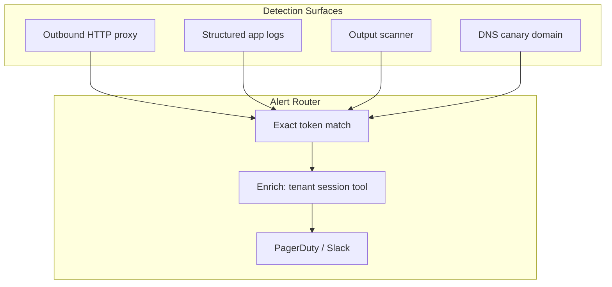

An engineer pasted a "sample" API key into a shared prompt template. Three weeks later, GitHub's secret scanner stayed quiet—the key was fake, generated by your security team as a canary. The alert that fired instead came from your outbound proxy: something inside a production agent session had attempted to call `api.openai.com` with that decoy key embedded in an Authorization header. The exfil path was a prompt-injection chain that convinced the agent to echo environment variables through a webhook tool.

Canary tokens—sometimes called honeytokens—are not new. Thinkst Canary popularized hardware and cloud canaries for network intruders. Agent systems need the same tripwire logic because attack surfaces expanded: prompts live in repos, RAG corpora sync from wikis, and tools hold credentials the LLM can theoretically invoke. This post covers where to plant tokens, how to wire alerts, and how to run them without breaking legitimate agent behavior.

## Threat model: what canaries catch for agents

| Scenario | How the token fires | What you learn |
|----------|---------------------|----------------|
| Prompt corpus scraped from repo | Token appears in external Pastebin | Which file/version leaked |
| RAG index exfil via injection | Agent quotes decoy doc in response | Retrieval boundary failure |
| Tool credential theft | Outbound call uses decoy API key | Which tool path was abused |
| Insider copying system prompt | Token in Slack screenshot OCR alert | Social exfil channel |
| Compromised CI artifact | Token in published Docker layer | Build pipeline breach |

Canaries do not replace secret rotation or vault storage. They provide **early signal** with **deterministic attribution**—each token ID maps to one placement.

## Token design and generation

Effective canary tokens must be unique globally, resemble real secrets enough to entice copy-paste, and be registered in an alert system the moment they are created.

```python
# security/canary_factory.py
import hashlib
import secrets
from dataclasses import dataclass
from datetime import datetime, timezone

@dataclass(frozen=True)
class CanaryToken:
    token_id: str          # e.g. "CANARY-RAG-finance-q3-001"
    surface: str           # "rag" | "prompt" | "tool" | "env"
    value: str             # the decoy secret itself
    created_at: str

def generate_openai_style_key(token_id: str) -> CanaryToken:
    # sk-proj- prefix mimics real OpenAI project keys
    body = secrets.token_hex(24)
    value = f"sk-proj-canary-{body}"
    return CanaryToken(
        token_id=token_id,
        surface="tool",
        value=value,
        created_at=datetime.now(timezone.utc).isoformat(),
    )

def generate_rag_fragment(token_id: str) -> CanaryToken:
    # Unique sentence embedded in decoy document
    digest = hashlib.sha256(token_id.encode()).hexdigest()[:16]
    value = f"INTERNAL REV ONLY canary-{digest} DO NOT DISTRIBUTE"
    return CanaryToken(
        token_id=token_id,
        surface="rag",
        value=value,
        created_at=datetime.now(timezone.utc).isoformat(),
    )
```

Register every token in your alert platform at creation time. Never reuse token values across environments—staging canaries that match production patterns create alert ambiguity.

## Placement patterns in agent architecture

**System prompt footer.** Append a comment block containing a decoy AWS access key ID. Legitimate inference ignores it; exfiltration payloads often dump the full system message.

```
<!-- CANARY-PLACEHOLDER: AKIAIOSFODNN7CANARY001 -->
You are a helpful assistant for Acme Corp internal wiki...
```

**RAG decoy documents.** Create low-rank documents with titles like "2025 Executive Compensation — CONFIDENTIAL." Body includes the canary fragment. Metadata flags: `classification: canary`, `retrieval_boost: -999`.

**Tool credential store.** Add a fake `SALESFORCE_CANARY` entry alongside real secrets in the vault path the agent reads. Real tools never reference it; injection-driven tool calls might.

**Vector index canary points.** Insert one embedding per sensitive namespace. If bulk export or debug endpoints dump vectors, scan exports for canary IDs.

## Alert pipeline architecture



**Outbound proxy.** Inspect Authorization headers, query strings, and request bodies for registered token strings. This catches agents tricked into forwarding secrets to attacker URLs.

**Log pipeline.** Stream logs through a lightweight matcher (Vector, Fluent Bit filter, or CloudWatch metric filter). Exact string match only—no regex on secret formats.

**Output scanner.** Before returning LLM responses to users, scan for canary substrings. A hit means retrieval or prompt leakage into the visible answer—treat as SEV-1.

**DNS canaries.** Register tokens as subdomains: `canary-{id}.leak-detector.example`. If anything performs DNS lookup on that name, you have a live exfil attempt. Thinkst-style HTTP canaries extend this with unique URLs embedded in decoys.

```typescript
// middleware/canary-output-guard.ts
import { CANARY_REGISTRY } from "../security/registry";

export function scanForCanaries(text: string, ctx: RequestContext): void {
  for (const entry of CANARY_REGISTRY) {
    if (text.includes(entry.value)) {
      emitAlert({
        severity: "critical",
        tokenId: entry.tokenId,
        surface: entry.surface,
        sessionId: ctx.sessionId,
        tenantId: ctx.tenantId,
        toolChain: ctx.toolChain,
        snippet: redact(text, entry.value),
      });
      // Fail closed: do not return leaked canary content to user
      throw new CanaryTripwireError(entry.tokenId);
    }
  }
}
```

## Integration with Thinkst Canary and equivalents

Commercial canary platforms provide hosted DNS/HTTP tokens, email canaries, and Azure/AWS decoy objects. For agent workloads:

- Embed Thinkst Canary URLs in RAG documents marked as fake credentials the agent should never call.
- Use API-generated tokens via their REST API when spinning up new agent tenants—one canary per tenant for blast-radius attribution.
- Route alerts into the same on-call rotation as production security incidents; canary alerts are not informational.

Self-hosted alternatives work for air-gapped environments: maintain a SQLite registry and Grafana Loki alert rules on `{job="agent"} |= "canary-"`.

## Avoiding false negatives and false positives

**False negative: token too obvious.** `FAKE_KEY_DO_NOT_USE` never gets copied. Mimic real formats.

**False negative: token never indexed.** Verify decoy RAG docs are embedded—run a direct ID fetch in staging.

**False positive: token in alert payload.** When firing alerts, reference `token_id` not `token_value` in Slack messages.

**False positive: eval fixtures.** Exclude canary strings from golden-set expected outputs unless testing the guard itself.

Rotate canaries quarterly. Long-lived tokens that appear in legitimate audit logs lose investigative value.

## Operational runbook

When a canary fires:

1. **Isolate session** — disable tenant API key, preserve session trace.
2. **Classify surface** — token ID reveals prompt vs RAG vs tool leak.
3. **Pull artifact** — prompt version, retrieval log, tool invocation JSON.
4. **Scope blast radius** — search for sibling tokens from same deploy window.
5. **Legal/comms** — if external exfil confirmed, engage incident response playbook.

Do not immediately delete the canary document—attribution evidence lives in version history.

## Compliance and audit value

Auditors ask: "How do you detect unauthorized disclosure of AI system instructions?" Canary tokens provide demonstrable detective control. Document the registry, alert SLA, and last test date in your SOC 2 evidence pack. Red-team exercises should include injection attempts specifically targeting canary exfil—validate the tripwire fires before the real vault secret does.

## Closing

Canary token alerts turn agent security from passive hope into active instrumentation. Plant decoys at every layer an attacker would copy—prompts, indexes, credentials—and wire exact-match detection on outbound traffic, logs, and user-visible outputs. When the token fires, you know not just that a leak happened, but which door was opened.

## Resources

- [Thinkst Canary — honeytoken product documentation](https://docs.canary.tools/)
- [AWS Secrets Manager vs honeytokens (detective controls)](https://docs.aws.amazon.com/secretsmanager/latest/userguide/intro.html)
- [OWASP LLM Top 10 — LLM02 Sensitive Information Disclosure](https://owasp.org/www-project-top-10-for-large-language-model-applications/)
- [MITRE ATT&CK — T1552 Unsecured Credentials](https://attack.mitre.org/techniques/T1552/)
- [OpenAI safety best practices for API key handling](https://platform.openai.com/docs/guides/safety-best-practices)
