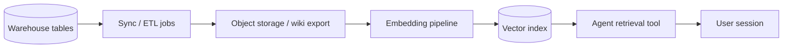

A support agent started hallucinating return policies on a Tuesday. Retrieval looked healthy—same index, same chunk count. The actual problem was an upstream rename: `returns_policy_v2` had shipped to the warehouse Friday night, but the RAG sync job still read `returns_policy_v1`, which product had archived. Nobody updated the catalog entry because there was no catalog entry—just a Slack thread from six months ago saying "Sarah owns docs."

Data catalogs—**DataHub** and **Amundsen** being the two most deployed open-source options—exist to prevent exactly this class of drift. For agent teams, they are not DBA vanity projects. They are the map of what your model can see, who is allowed to change it, and which production agents depend on each dataset.

## The agent data plane catalog must cover

Traditional catalogs index warehouse tables. Agent systems add layers:



Lineage must span the full chain. Breaking any link causes retrieval regression or policy violation. Catalog entries at each node:

| Asset type | Example | Critical metadata |
|------------|---------|-------------------|
| Source table | `prod.support_articles` | Owner, PII tags, refresh SLA |
| Export job | `airflow.sync_support_docs` | Schedule, last success, schema hash |
| Corpus bucket | `s3://rag/support/` | Version, document count, retention |
| Embedding run | `embed-v3-2025-03-01` | Model, chunk size, overlap |
| Vector collection | `support_qdrant_v3` | URI, replica count, agent consumers |
| Agent tool | `search_support_kb` | Prompt dependency, fallback index |

## Amundsen: discovery-first catalog

Amundsen optimizes **findability**. Data scientists and agent engineers search by plain language, see table popularity, read curated descriptions, and Slack the owner from the UI.

Typical deployment: Neo4j graph for relationships, Elasticsearch for search, frontend React app, metadata service ingesting from Hive/Postgres/Snowflake/dbt.

**Agent team workflow in Amundsen:**

1. Search "customer refund" → land on `refund_policy_docs` dataset page.
2. Read description: "Synced daily from Confluence space REFUND; owner @sarah."
3. Check lineage tab: Confluence export → S3 → embedding DAG → `refund_qdrant`.
4. See downstream: `support-agent-v2` tagged as consumer (via custom metadata).

Register agent consumers with a custom programmatic metadata push:

```python
# catalog/amundsen_agent_registration.py
from databuilder.extractor.rest_api_extractor import RestApiExtractor
from databuilder.loader.file_system_mysql_csv_loader import FSMySQLCSVLoader
from databuilder.task import DefaultTask
from databuilder.transformers.dict_to_model import DictToModelTransformer

def register_agent_consumer(
    table_uri: str,
    agent_name: str,
    tool_name: str,
    index_collection: str,
):
    """Push custom metadata: which agent tool reads this dataset."""
    payload = {
        "table_uri": table_uri,
        "agent_consumers": [
            {
                "agent": agent_name,
                "tool": tool_name,
                "vector_collection": index_collection,
                "registered_at": datetime.utcnow().isoformat(),
            }
        ],
    }
    # Wire into your Amundsen databuilder ETL job
    # See: https://www.amundsen.io/amundsen/databuilder/
    publish_metadata(payload)
```

Amundsen shines when the primary pain is **"I cannot find the right corpus"** and culture rewards rich descriptions and ownership badges.

## DataHub: governance and active metadata

DataHub treats metadata as an **event stream**—Kafka-backed MCP (Metadata Change Proposal) ingestion. Tags, glossary terms, lineage, and assertions (freshness, volume) update continuously.

**Features agent teams leverage:**

- **Lineage API** — programmatic upstream/downstream queries for CI gates.
- **Glossary** — bind terms like "PII-Sensitive" to datasets; block agent ingestion if untagged.
- **Assertions** — fail Airflow task if `support_articles` row count drops 50% vs yesterday before re-embedding.
- **Domains** — partition metadata by product line (`support-agents`, `sales-agents`).

Emit lineage from the embedding pipeline:

```yaml
# datahub/lineage_emitter.yaml
# OpenLineage-compatible event (simplified)
eventType: COMPLETE
eventTime: "2025-03-09T14:00:00Z"
run:
  runId: embed-support-v3-run-4421
job:
  namespace: airflow
  name: embed_support_docs
inputs:
  - namespace: s3
    name: rag/support/export-2025-03-09/
outputs:
  - namespace: qdrant
    name: support_qdrant_v3
```

DataHub ingests OpenLineage events and renders graph edges in the UI. CI can query: "Does `support_qdrant_v3` still have upstream `returns_policy_v2`?" before promoting an agent deploy.

```python
# ci/check_lineage_before_deploy.py
import requests

DATAHUB_GMS = "http://datahub-gms:8080"

def assert_upstream(dataset_urn: str, expected_upstream: str) -> None:
    query = """
    query upstream($urn: String!) {
      dataset(urn: $urn) {
        upstream { relationships { entity { urn } } }
      }
    }
    """
    resp = requests.post(
        f"{DATAHUB_GMS}/api/graphql",
        json={"query": query, "variables": {"urn": dataset_urn}},
    )
    upstreams = [
        r["entity"]["urn"]
        for r in resp.json()["data"]["dataset"]["upstream"]["relationships"]
    ]
    if expected_upstream not in upstreams:
        raise RuntimeError(
            f"Deploy blocked: {dataset_urn} missing upstream {expected_upstream}. "
            f"Found: {upstreams}"
        )
```

## Choosing between DataHub and Amundsen

| Criterion | Amundsen | DataHub |
|-----------|----------|---------|
| Primary UX | Search & discovery | Graph, governance, API |
| Lineage depth | Good (manual + ingestion) | Strong (OpenLineage native) |
| Operational overhead | Moderate (Neo4j + ES) | Higher (Kafka + GMS + UI) |
| Policy automation | Limited | Tags, assertions, contracts |
| Agent runtime tool | Search API | GraphQL + REST |
| Maturity path | Maintenance mode concerns; LF Amundsen | Active LF AI & Data Foundation project |

Many enterprises standardize on **DataHub** for new deployments; Amundsen remains valuable if already embedded or if teams prioritize lightweight discovery without Kafka infrastructure.

Hybrid pattern: ingest into DataHub as source of truth, sync summary fields to an internal docs portal agents read during development.

## Catalog-driven agent development workflows

**PR checklist for new RAG sources.** Require catalog URN in the pull request. CI verifies dataset exists, owner assigned, PII tag present, lineage edge to vector collection registered.

**On-call runbook linkage.** Each agent tool config stores `catalog_urn`. Incident dashboard links directly to catalog page for the corpus behind failing retrieval.

**Agent tool: `discover_datasets`.** Read-only GraphQL query against DataHub for planning tasks—"which tables mention churn?"—without hitting production vectors.

```typescript
// tools/discover-datasets.ts
const DISCOVER = `
  query search($query: String!) {
    search(input: { type: DATASET, query: $query, start: 0, count: 5 }) {
      searchResults {
        entity {
          ... on Dataset {
            urn
            name
            properties { description }
            ownership { owners { owner { username } } }
            tags { tags { tag { name } } }
          }
        }
      }
    }
  }
`;

export async function discoverDatasets(query: string) {
  const res = await fetch(`${DATAHUB_GMS}/api/graphql`, {
    method: "POST",
    headers: { "Content-Type": "application/json" },
    body: JSON.stringify({ query: DISCOVER, variables: { query } }),
  });
  return res.json();
}
```

Guardrails: rate-limit tool calls, strip PII tags from LLM-visible summaries if users are external, log all catalog queries for audit.

## PII, retention, and compliance

Catalogs centralize classification. Before embedding:

1. Tag columns/documents with glossary term `PII.DirectIdentifier`.
2. DataHub assertion: zero PII-tagged fields in `public_agent_corpus` domain.
3. Retention policy on catalog entity: `support_chats` → 90 days → triggers re-embed job on purge.

Auditors ask what data entered the model. Lineage from warehouse → vector index → agent session log (with corpus version hash) closes the loop. Store `embedding_run_id` in retrieval logs and point catalog to that run.

## Adoption tactics that work

**Do not boil the ocean.** Catalog the 20 datasets behind production agents first—not every warehouse table.

**Assign owners with SLA.** Owner field must be a team, not a person who left. Require quarterly description review.

**Automate ingestion.** Manual catalog entries rot. Hook dbt, Airflow, and embedding DAGs to emit metadata on every run.

**Measure discovery success.** Track search queries, click-through to datasets, and time-to-find in engineer surveys. If nobody uses the catalog, fix UX before adding fields.

## Failure modes

**Stale lineage.** Embedding job changes S3 path but lineage emitter still points to old bucket—CI passes, retrieval empty. Version lineage events with job git SHA.

**Over-tagging PII.** Everything marked sensitive → engineers ignore tags. Use automated classifiers with human review queue.

**Catalog vs source of truth confusion.** Catalog describes reality; it does not enforce it. Pair metadata with Airflow gates and vector sync checks.

## Closing

DataHub and Amundsen turn agent data from tribal knowledge into searchable, lineage-rich assets. Amundsen wins hearts with discovery UX; DataHub wins operational governance with events, assertions, and APIs. Agent teams need both capabilities in some proportion—find the corpus, trust its freshness, know who owns it, and prove what the model retrieved when something goes wrong.

## Resources

- [DataHub documentation — lineage and GraphQL API](https://datahubproject.io/docs/)
- [Amundsen documentation — architecture and databuilder](https://www.amundsen.io/amundsen/)
- [OpenLineage specification for pipeline events](https://openlineage.io/)
- [dbt exposures for downstream agent documentation](https://docs.getdbt.com/docs/build/exposures)
- [LF AI & Data Foundation — DataHub project](https://lfaidata.foundation/projects/datahub/)
