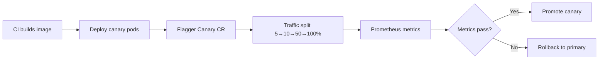

Shipping a new chunking strategy or reranker model feels routine until the canary starts returning irrelevant context and nobody notices for thirty minutes because error rates stayed at zero. Manual canary checks do not scale when RAG releases happen daily and quality regressions show up in user feedback before infrastructure dashboards move. [Flagger](https://flagger.app/)—the progressive delivery controller originally built at Weaveworks—automates the promote-or-rollback decision by comparing metrics between primary and canary pods during a controlled traffic shift.

This post is a practical guide to running Flagger against RAG retrieval services: which metrics matter, how to structure Canary CRDs, and where automated analysis breaks down for non-deterministic retrieval quality.

## Flagger in the RAG deployment stack

A typical RAG retrieval service runs as a Kubernetes Deployment behind a service mesh or ingress controller. Without Flagger, teams either big-bang deploy (risky) or manually shift Istio VirtualService weights while staring at Grafana (error-prone). Flagger closes the loop:



The Canary custom resource defines analysis intervals, metric thresholds, and webhook notifications. Flagger handles pod readiness, HPA interactions, and final promotion or rollback.

## Defining metrics that catch RAG regressions

Infrastructure metrics alone miss the failure modes that matter for retrieval. A canary with a broken hybrid search weight might show identical p95 latency while nDCG@10 drops fifteen points.

**Layer 1: Availability and latency**

```yaml
# flagger/canary-rag.yaml (metrics excerpt)
metrics:
  - name: request-success-rate
    thresholdRange:
      min: 99
    interval: 1m
  - name: request-duration
    thresholdRange:
      max: 500
    interval: 1m
```

These catch crashes and severe latency regressions. They will not catch semantic retrieval degradation.

**Layer 2: RAG-specific operational metrics**

Export these from your retrieval service:

- `rag_retrieval_chunks_returned` — histogram of chunk counts per query
- `rag_embedding_api_calls_total` — cost proxy; spikes indicate cache regression
- `rag_hybrid_search_fallback_rate` — ratio of BM25-only fallbacks when vector search fails
- `rag_reranker_timeout_rate` — cross-encoder saturation signal

```yaml
  - name: embedding-call-rate
    templateRef:
      name: rag-embedding-rate
      namespace: rag
    thresholdRange:
      max: 10
    interval: 2m
```

**Layer 3: Quality metrics**

Quality gates require offline or shadow evaluation exported to Prometheus:

```yaml
  - name: ndcg-at-10
    templateRef:
      name: rag-ndcg-shadow
      namespace: rag
    thresholdRange:
      min: 0.85
    interval: 5m
```

The MetricTemplate runs PromQL against gauges written by a shadow evaluator that scores canary retrieval results against a frozen query set.

## Canary CRD structure for RAG services

A complete Canary resource for a RAG retrieval deployment:

```yaml
apiVersion: flagger.app/v1beta1
kind: Canary
metadata:
  name: rag-retrieval
  namespace: production
spec:
  targetRef:
    apiVersion: apps/v1
    kind: Deployment
    name: rag-retrieval
  progressDeadlineSeconds: 600
  service:
    port: 8080
    targetPort: 8080
    gateways:
      - public-gateway.istio-system.svc.cluster.local
    hosts:
      - rag-api.internal.example.com
  analysis:
    interval: 1m
    threshold: 5
    maxWeight: 50
    stepWeight: 10
    metrics:
      - name: request-success-rate
        thresholdRange:
          min: 99
        interval: 1m
      - name: request-duration
        thresholdRange:
          max: 400
        interval: 1m
      - name: ndcg-at-10
        templateRef:
          name: rag-ndcg-shadow
          namespace: production
        thresholdRange:
          min: 0.82
        interval: 5m
    webhooks:
      - name: load-test
        url: http://flagger-loadtester.production/
        timeout: 5s
        metadata:
          cmd: "hey -z 1m -q 10 -c 2 http://rag-retrieval-canary.production:8080/health"
```

Key parameters:

- `stepWeight: 10` — increase canary traffic by 10% each interval
- `maxWeight: 50` — cap at 50% before final analysis
- `threshold: 5` — allow five failed checks before rollback
- `interval: 1m` — check frequency

## Shadow evaluation pipeline for quality gates

Automated rollback on retrieval quality requires a shadow path that does not affect user responses:

```python
# shadow/evaluator.py
import asyncio
from prometheus_client import Gauge

NDCG_GAUGE = Gauge("rag_canary_ndcg_at_10", "Shadow nDCG@10 for canary", ["variant"])

GOLDEN_QUERIES = load_golden_set("eval/queries_v3.jsonl")

async def shadow_eval_loop(canary_url: str, primary_url: str):
    while True:
        scores = {"canary": [], "primary": []}
        for item in GOLDEN_QUERIES:
            for variant, url in [("canary", canary_url), ("primary", primary_url)]:
                results = await retrieve(url, item["query"], top_k=10)
                scores[variant].append(ndcg_at_k(results, item["relevant_ids"], k=10))

        for variant in ["canary", "primary"]:
            avg = sum(scores[variant]) / len(scores[variant])
            NDCG_GAUGE.labels(variant=variant).set(avg)

        await asyncio.sleep(60)
```

Run this as a sidecar or separate Deployment. Flagger reads the canary gauge and compares against threshold. Statistical note: at 10% canary traffic, quality metrics need longer intervals (5m+) for stable estimates.

## Progressive delivery patterns for RAG components

Different RAG components need different canary strategies.

**Embedding model updates.** Highest risk—vector space shifts break retrieval silently. Run extended canary (30–60 min) with nDCG gate. Consider dual-write to both indexes during transition.

**Chunking strategy changes.** Requires reindex; canary the new ingestion pipeline separately from query serving. Do not canary query serving until new index is populated.

**Reranker model swaps.** Lower blast radius if bi-encoder retrieval is unchanged. Shorter canary window (10–15 min) with reranker timeout rate gate.

**Hybrid search weight tuning.** A/B test via feature flags first; use Flagger for the service binary that hosts the flag logic, not for weight values themselves.

## When Flagger analysis fails for RAG

Automated canary analysis has blind spots:

**Non-stationary query traffic.** Monday morning queries differ from Friday afternoon. Compare canary vs primary on the same traffic slice, not absolute thresholds alone. Use relative comparison: `canary_ndcg / primary_ndcg > 0.95`.

**Cold start on new indexes.** First queries after deploy hit empty caches and show inflated latency. Add warmup webhook before analysis starts.

**Low canary traffic volume.** At 5% traffic with 100 QPS total, canary sees 5 QPS—insufficient for rare query types. Increase `stepWeight` slowly or use synthetic load via loadtester webhook.

**Correlated failures.** If embedding API is degraded, both primary and canary fail together and Flagger sees no difference. Add external dependency health checks independent of variant comparison.

## Integration with GitOps and CI

Flagger works naturally with Flux or Argo CD:

1. CI builds and pushes image with semver tag
2. GitOps repo updates Deployment image field
3. Flagger detects new pod spec and starts canary analysis
4. On success, Flagger updates primary Deployment; on failure, reverts

```yaml
# .github/workflows/rag-deploy.yaml (excerpt)
- name: Update deployment manifest
  run: |
    yq -i '.spec.template.spec.containers[0].image = "${{ env.IMAGE }}"' \
      k8s/rag-retrieval/deployment.yaml
    git commit -am "deploy rag-retrieval ${{ env.VERSION }}"
    git push
```

Avoid manual `kubectl set image`—it bypasses GitOps reconciliation and confuses Flagger state.

## Alerting and incident response

Configure Flagger webhooks to Slack or PagerDuty:

```yaml
    webhooks:
      - name: slack-notification
        type: event
        url: https://hooks.slack.com/services/XXX
        metadata:
          type: rollback
          channel: rag-deploys
```

When Flagger rolls back:

1. Check which metric failed—latency vs quality vs cost
2. Pull canary pod logs for retrieval errors
3. Run offline eval against canary endpoint manually
4. Fix and redeploy; do not override Flagger thresholds without understanding the regression

## Closing thoughts

Flagger turns RAG deploys from anxiety-inducing events into routine automation—but only if you export the right metrics. Availability gates are necessary; quality gates are what prevent silent retrieval regressions. Invest in shadow evaluation infrastructure before you need it, and tune analysis intervals for the statistical stability your traffic volume allows.

## Integration notes for canary analysis flagger

This rarely lives alone. Map upstream dependencies (auth, data stores, queues) and downstream consumers before you harden the happy path. Sequence the rollout: observability first, then flags, then the risky behavior change. That order turns rollback into a flag flip instead of a reverse migration under pressure. Keep the integration diagram in the same repo as the code so it cannot rot in a slide deck.

## Resources

- [Flagger documentation](https://docs.flagger.app/)
- Prometheus MetricTemplate CRD reference
- Weaveworks progressive delivery blog posts
- Offline RAG evaluation golden set design patterns
