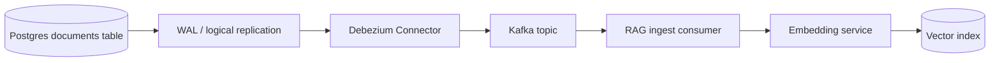

The knowledge base lived in Postgres—`documents` table with `title`, `body`, `updated_at`, and `tenant_id`. Nightly batch jobs pulled rows where `updated_at > yesterday` and reindexed. Deletes never propagated: archived documents stayed in the vector index for months. A compliance audit found 12,000 ghost chunks from deleted records still retrievable. The fix was not a better cron schedule—it was change data capture with Debezium reading the Postgres WAL and streaming every insert, update, and delete to the RAG ingestion pipeline in real time.

CDC-driven RAG sync treats the relational database as source of truth and the vector index as a derived projection that must converge continuously. This post covers Debezium setup for Postgres, event handling for document rows, and operational patterns for incremental embedding without melting the GPU cluster.

## Architecture: Postgres WAL to RAG index



Each row change becomes a Kafka message. The RAG consumer transforms document payloads into chunk-and-embed operations, with DELETE events triggering chunk removal.

## Postgres prerequisites

Enable logical replication on the source:

```sql
-- Requires superuser or rds_superuser on RDS
ALTER SYSTEM SET wal_level = logical;
-- Restart required on self-managed; RDS requires parameter group change

CREATE PUBLICATION rag_documents FOR TABLE documents;

CREATE USER debezium_user WITH REPLICATION LOGIN PASSWORD 'secure_password';
GRANT SELECT ON documents TO debezium_user;
GRANT USAGE ON SCHEMA public TO debezium_user;
```

On Amazon RDS:

```
rds.logical_replication = 1
max_replication_slots >= 4  (headroom beyond Debezium)
max_wal_senders >= 4
```

Verify:

```sql
SELECT * FROM pg_publication_tables WHERE pubname = 'rag_documents';
SHOW wal_level;  -- should be 'logical'
```

## Debezium connector configuration

Deploy via Kafka Connect:

```json
{
  "name": "postgres-documents-rag",
  "config": {
    "connector.class": "io.debezium.connector.postgresql.PostgresConnector",
    "database.hostname": "postgres.internal.example.com",
    "database.port": "5432",
    "database.user": "debezium_user",
    "database.password": "${secrets:postgres/debezium_password}",
    "database.dbname": "knowledge_base",
    "database.server.name": "kb",
    "table.include.list": "public.documents",
    "plugin.name": "pgoutput",
    "publication.name": "rag_documents",
    "slot.name": "debezium_rag_documents",
    "transforms": "unwrap",
    "transforms.unwrap.type": "io.debezium.transforms.ExtractNewRecordState",
    "transforms.unwrap.drop.tombstones": "false",
    "key.converter": "org.apache.kafka.connect.json.JsonConverter",
    "value.converter": "org.apache.kafka.connect.json.JsonConverter"
  }
}
```

Key settings:

- `pgoutput` plugin — native Postgres 10+ logical decoding
- `ExtractNewRecordState` — flattens Debezium envelope to plain row JSON
- `drop.tombstones: false` — preserve DELETE events for index purge

## Event schema and RAG consumer logic

Debezium emits events with operation type:

```json
{
  "op": "u",
  "after": {
    "id": "doc-uuid-123",
    "tenant_id": "acme",
    "title": "Updated Refund Policy",
    "body": "Full markdown content...",
    "updated_at": 1721184000000
  },
  "before": {
    "id": "doc-uuid-123",
    "body": "Previous content..."
  }
}
```

Consumer handler:

```python
# consumers/document_cdc.py
import hashlib
from dataclasses import dataclass
from enum import Enum

class Op(Enum):
    CREATE = "c"
    UPDATE = "u"
    DELETE = "d"
    READ = "r"  # snapshot, treat as CREATE

@dataclass
class DocumentEvent:
    op: Op
    doc_id: str
    tenant_id: str
    title: str | None
    body: str | None
    content_hash: str | None

def parse_debezium_event(raw: dict) -> DocumentEvent | None:
    op = Op(raw["op"])
    if op == Op.DELETE:
        before = raw.get("before", {})
        return DocumentEvent(
            op=op,
            doc_id=before["id"],
            tenant_id=before["tenant_id"],
            title=None,
            body=None,
            content_hash=None,
        )
    after = raw.get("after", {})
    if not after:
        return None
    body = after.get("body", "")
    return DocumentEvent(
        op=op,
        doc_id=after["id"],
        tenant_id=after["tenant_id"],
        title=after.get("title"),
        body=body,
        content_hash=hashlib.sha256(body.encode()).hexdigest(),
    )

async def handle_document_event(event: DocumentEvent, state: DocumentState):
    if event.op == Op.DELETE:
        await vector_index.delete_by_doc_id(event.doc_id, event.tenant_id)
        await state.remove(event.doc_id)
        return

    # Skip re-embed if content unchanged
    if event.op == Op.UPDATE:
        existing = await state.get_hash(event.doc_id)
        if existing == event.content_hash:
            return

    chunks = chunk_document(event.body, event.title)
    embeddings = await embed_batch(chunks)
    await vector_index.upsert(
        doc_id=event.doc_id,
        tenant_id=event.tenant_id,
        chunks=chunks,
        embeddings=embeddings,
    )
    await state.set_hash(event.doc_id, event.content_hash)
```

Content hash diffing prevents re-embedding when `updated_at` changes but body does not (common with metadata-only updates).

## Debouncing high-frequency edits

Collaborative editing generates rapid UPDATE events. Debounce per document:

```python
import asyncio
from collections import defaultdict

pending: dict[str, asyncio.Task] = {}
DEBOUNCE_SEC = 45

async def debounced_handle(event: DocumentEvent):
    doc_id = event.doc_id
    if doc_id in pending:
        pending[doc_id].cancel()

    async def _delayed():
        await asyncio.sleep(DEBOUNCE_SEC)
        await handle_document_event(event, state)
        del pending[doc_id]

    pending[doc_id] = asyncio.create_task(_delayed())
```

Forty-five seconds coalesces edit sessions without noticeable retrieval staleness for internal docs. Customer-facing docs may need shorter windows.

## Initial snapshot and offset management

Debezium performs an initial snapshot of existing rows on first connect (`snapshot.mode: initial` default). For large tables:

```json
"snapshot.mode": "initial",
"snapshot.fetch.size": 1024,
"max.batch.size": 2048
```

Snapshot rows emit as `op: "r"` (read). Handle identically to CREATE.

Monitor replication lag:

```sql
SELECT slot_name, pg_size_pretty(pg_wal_lsn_diff(pg_current_wal_lsn(), restart_lsn)) AS lag
FROM pg_replication_slots
WHERE slot_name = 'debezium_rag_documents';
```

Lag growing unbounded means the consumer cannot keep up—scale embedding workers or increase Kafka partition count.

## DELETE propagation and tombstones

Vector indexes rarely support native DELETE by metadata filter efficiently. Strategies:

**Metadata-filtered delete.** If your vector DB supports delete by `doc_id` metadata (Pinecone namespaces, Weaviate batch delete), use it directly.

**Tombstone markers.** Write zero-vector or sentinel entries with `deleted: true` metadata; filter at query time. Simpler but index bloat accumulates—schedule compaction.

**Full chunk ID tracking.** Maintain Postgres table mapping `doc_id → chunk_ids`. On DELETE, delete specific chunk IDs from index.

Verify DELETE propagation in integration tests—this is the most commonly missed CDC requirement.

## Multi-tenant considerations

Partition Kafka topic by `tenant_id` for isolation:

```json
"transforms": "unwrap,route",
"transforms.route.type": "org.apache.kafka.connect.transforms.RegexRouter",
"transforms.route.regex": "kb.public.documents",
"transforms.route.replacement": "rag.documents.${tenant_id}"
```

Or use single topic with tenant_id in message key for ordered processing per tenant.

Row-level security on Postgres does not affect Debezium—it reads WAL directly. Authorization for retrieval remains in the query path, not CDC.

## Failure modes and recovery

**Replication slot bloat.** If Debezium stops, WAL accumulates. Monitor disk usage; set `slot.max.wal.keep` alerts.

**Schema migrations.** Adding columns is safe—Debezium adapts. Renaming columns or changing primary key requires connector restart and may need snapshot refresh.

**Consumer offset reset.** On catastrophic index corruption, reset consumer to earliest offset and replay (with idempotent upsert).

**Duplicate events.** At-least-once delivery means duplicates. Upsert by chunk ID must be idempotent.

## Alternatives and complements

- **PgNotify** — lighter weight for low-volume, same-database triggers
- **Temporal workflows** — orchestrate reindex with retry and visibility
- **Outbox pattern** — if you control the write path, emit events in same transaction as row update

CDC shines when Postgres is already source of truth and you need reliable DELETE propagation without application code changes.

## Monitoring CDC pipeline health

Key metrics for Debezium RAG sync: replication lag (bytes behind head), consumer processing rate vs produce rate, content-hash skip rate (updates that did not require re-embed), and DELETE propagation latency. Alert when lag exceeds five minutes during steady state or when DELETE events fail to purge vector index chunks within ten minutes.

Run monthly CDC drills: insert/update/delete test documents in Postgres and verify vector index convergence within SLA. Include a "schema migration" drill where a new nullable column is added—Debezium should continue without connector restart on additive migrations.

## Common regressions around cdc debezium postgres

Teams often pass a demo and then regress under load: retries without jitter, missing idempotency keys, or caches that never invalidate. Write a short regression list specific to cdc debezium postgres and turn each item into an automated check or a game-day step. Prefer failing CI on the regression over discovering it from customer tickets. When you change defaults, update alerts in the same pull request so observability stays coupled to behavior.

## Resources

- Debezium PostgreSQL connector documentation
- Postgres logical replication monitoring guide
- Kafka Connect distributed mode deployment patterns
