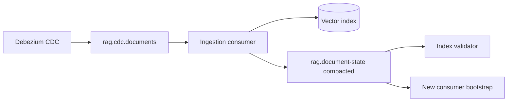

A new RAG ingestion consumer deployed on Friday needed the current document metadata for 2 million docs to know which chunks to validate against the vector index. The team considered replaying six months of CDC events from the raw topic—estimated 48 hours. Instead, they pointed the consumer at the compacted `rag.document-state` topic: 2 million keys, one latest record each, consumed in 22 minutes. Log compaction had been running silently in the background, keeping only the most recent state per doc_id.

Compacted Kafka topics are changelog stores—durable, ordered, key-value histories where only the final state matters. For RAG pipelines tracking document ingestion state across multiple consumers, they eliminate full-history replay and provide a recovery path when vector indexes drift from source metadata.

## Compaction mechanics

Kafka log compaction runs periodically:

```
Before compaction (key=doc-123):
  offset 100: {doc_id: "123", chunks: 5, version: 1}
  offset 450: {doc_id: "123", chunks: 8, version: 2}
  offset 900: {doc_id: "123", chunks: 8, version: 2, deleted: false}

After compaction:
  offset 900: {doc_id: "123", chunks: 8, version: 2, deleted: false}
  (offsets 100, 450 removed)
```

Tombstone records (`value: null`) delete a key entirely after `delete.retention.ms` (default 24 hours).

## Topic configuration for RAG document state

```properties
# kafka topic create
kafka-topics.sh --create \
  --topic rag.document-state \
  --partitions 32 \
  --replication-factor 3 \
  --config cleanup.policy=compact \
  --config min.compaction.lag.ms=60000 \
  --config segment.ms=3600000 \
  --config delete.retention.ms=86400000 \
  --config min.cleanable.dirty.ratio=0.1
```

Key settings:

- `cleanup.policy=compact` — enable compaction (can combine with `delete` for hybrid)
- `min.compaction.lag.ms=60000` — wait 60s before compacting new records (allows consumer catch-up)
- `delete.retention.ms=86400000` — tombstones visible for 24h before removal
- `min.cleanable.dirty.ratio=0.1` — trigger compaction when 10% of log is superseded

Partition by hash of `doc_id` for even distribution and ordered per-document updates.

## Message schema for RAG state

```json
{
  "key": "doc-uuid-123",
  "value": {
    "doc_id": "doc-uuid-123",
    "tenant_id": "acme",
    "corpus_version": "v47",
    "chunk_count": 12,
    "content_hash": "sha256:abc123...",
    "embedding_model": "text-embedding-3-large-v1",
    "chunk_ids": ["chunk-1", "chunk-2", "..."],
    "indexed_at": "2026-07-17T10:30:00Z",
    "deleted": false
  }
}
```

Tombstone for deletion:

```json
{
  "key": "doc-uuid-123",
  "value": null
}
```

Producers write after successful vector index upsert—compacted topic reflects indexed state, not merely received events.

## Producer integration in ingestion pipeline

```python
# producers/document_state_changelog.py
from confluent_kafka import Producer
import json

producer = Producer({"bootstrap.servers": "kafka:9092"})

def publish_document_state(doc_state: DocumentState):
    producer.produce(
        topic="rag.document-state",
        key=doc_state.doc_id.encode(),
        value=json.dumps(doc_state.to_dict()).encode(),
        callback=delivery_report,
    )
    producer.poll(0)

def publish_document_deleted(doc_id: str):
    producer.produce(
        topic="rag.document-state",
        key=doc_id.encode(),
        value=None,  # tombstone
    )
    producer.poll(0)
```

Call after vector index write succeeds—compacted topic is the commit point for "what the index should reflect."

## Consumer bootstrap from compacted topic

New consumers read from `earliest` offset to build local state:

```python
# consumers/state_bootstrap.py
from confluent_kafka import Consumer

consumer = Consumer({
    "bootstrap.servers": "kafka:9092",
    "group.id": "rag-index-validator-v2",
    "auto.offset.reset": "earliest",
    "enable.auto.commit": False,
})

consumer.subscribe(["rag.document-state"])
state: dict[str, DocumentState] = {}

while True:
    msg = consumer.poll(1.0)
    if msg is None:
        break
    if msg.error():
        continue

    doc_id = msg.key().decode()
    if msg.value() is None:
        state.pop(doc_id, None)  # tombstone
    else:
        state[doc_id] = DocumentState.from_json(msg.value())

# state now holds latest metadata for all 2M docs
validate_index_against_state(state)
```

After bootstrap, consumer switches to incremental mode reading new records from compacted topic or raw CDC topic.

## Compacted topic vs raw CDC topic

Use both in layered architecture:

| Topic | cleanup.policy | Purpose |
|-------|---------------|---------|
| `rag.cdc.documents` | delete (7 days) | Full event history, audit, replay |
| `rag.document-state` | compact | Latest state per doc, bootstrap |



Raw topic feeds processing; compacted topic feeds state queries.

## Kafka Streams KTable equivalent

If using Kafka Streams, compacted topic backs a KTable:

```java
StreamsBuilder builder = new StreamsBuilder();
KTable<String, DocumentState> docState = builder.table(
    "rag.document-state",
    Consumed.with(Serdes.String(), documentStateSerde)
);

docState.toStream()
    .filter((docId, state) -> state != null && !state.isDeleted())
    .to("rag.active-documents");
```

KTable changelog topic is automatically compacted. Materialized state stores rebuild from compacted changelog on restart.

## Operational concerns

**Compaction lag.** Monitor `kafka.log:type=LogCleanerManager,name=max-dirty-percent` and compaction rate. Lag grows if compaction cannot keep pace with write rate—increase resources or partition count.

**Tombstone visibility.** Consumers must process tombstones within `delete.retention.ms` or miss deletions. If consumer is down >24h, run full compacted topic scan from earliest.

**Key size.** Compaction is per-key. If keys are unbounded (e.g., query-level state), compaction provides no benefit. Key by doc_id, not chunk_id, for document-level state.

**Null value handling.** Some serializers struggle with tombstones. Use explicit `deleted: true` flag in value as backup, with tombstone for true removal.

**Hybrid cleanup.** `cleanup.policy=compact,delete` applies both compaction and time retention—old keys with no recent updates get removed entirely. Useful for ephemeral document state with 90-day lifecycle.

## Recovery scenarios

**Vector index corruption.** Bootstrap consumer state from compacted topic, compare chunk_ids against index, re-embed mismatches.

**New region deployment.** Consumer reads compacted topic, bulk upserts to new regional index—no source database export needed.

**Consumer group reset.** Reset offset to earliest on compacted topic—rebuilds state in minutes vs hours from raw CDC.

**Audit "what is indexed."** Compact topic is queryable inventory of indexed documents—cross-reference with data catalog.

## Testing compaction behavior

Verify in staging:

1. Produce 1000 records with same key, different values
2. Force compaction: `kafka-log-dirs.sh` or wait for segment roll
3. Consume from earliest—should see one record per key
4. Produce tombstone, verify key absent after delete.retention.ms
5. Measure bootstrap time for production-scale key count

## Compacted topic capacity planning

Size compacted topic disk as: unique_keys × avg_record_size × 1.3 headroom. Monitor growth rate during bulk reindex—temporary spike is normal; sustained growth after reindex completes indicates compaction falling behind. Partition count affects parallel compaction; increase partitions when single-partition log size exceeds 50 GB despite healthy compaction metrics.

## Consumer offset management best practices

Document consumer group offset reset procedures for each RAG compacted topic consumer. Index validator reset to earliest replays full state—acceptable monthly for drift correction. Ingestion consumer reset to latest loses historical state—never reset without understanding consequences. Use kafka-consumer-groups.sh --describe --group rag-index-validator to monitor lag. Lag on compacted topic during steady state should be near zero; sustained lag indicates consumer cannot keep pace with produce rate during bulk reindex.


## Production rollout notes

When migrating RAG consumers to new compacted topic version, use dual-write period: producer writes to both old and new topics for seven days while consumers catch up on new topic. Cut over consumer offset after lag zero on new topic. Delete old topic only after confirming no consumer groups reference it—kafka-consumer-groups.sh lists all groups including stale ones.


Kafka topic quota bytes per partition prevents runaway compacted topic growth from crashing broker. Set quota on rag.document-state topic at 2× expected steady-state size. Alert at 80% quota triggers compaction review before hard limit blocks producers.

## Common regressions around changelog compacted topics

Teams often pass a demo and then regress under load: retries without jitter, missing idempotency keys, or caches that never invalidate. Write a short regression list specific to changelog compacted topics and turn each item into an automated check or a game-day step. Prefer failing CI on the regression over discovering it from customer tickets. When you change defaults, update alerts in the same pull request so observability stays coupled to behavior.

## Resources

- Kafka log compaction documentation
- Confluent blog: compacted topics as changelog
- Kafka Streams state store recovery
- Debezium + compacted topic patterns
