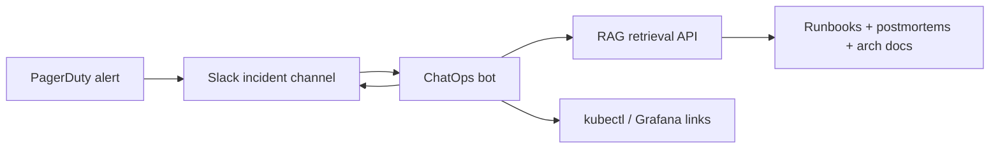

PagerDuty fired at 03:14 for `RAGRetrievalHighLatency`. The on-call engineer typed `/incident ask rag retrieval p95 spike runbook` in Slack. The bot returned: the latency triage section from the RAG platform runbook, a link to a postmortem from March when embedding cache stampede caused identical symptoms, current deployment info for rag-retrieval (v2.4.1 deployed 47 minutes ago), and the first three kubectl commands from the diagnostic playbook—with Confluence source links for each chunk. Time to first actionable step: twelve seconds vs the usual eight minutes hunting docs half-asleep.

ChatOps incident bots augmented with RAG turn static runbook libraries into queryable incident context. The bot is not replacing the engineer—it is eliminating document archaeology during the highest-stress minutes of an outage.

## Architecture: alert to grounded response



Alert webhook optionally pre-fetches context before human arrives.

## Slack bot with RAG backend

```python
# bot/incident_bot.py
from slack_bolt.async_app import AsyncApp
from slack_bolt.adapter.socket_mode.async_handler import AsyncSocketModeHandler

app = AsyncApp(token=os.environ["SLACK_BOT_TOKEN"])

@app.command("/incident")
async def handle_incident(ack, command, client, say):
    await ack()
    text = command["text"].strip()
    subcommand, _, query = text.partition(" ")

    if subcommand == "ask":
        response = await rag_query(
            query=query,
            collections=["runbooks", "postmortems", "architecture"],
            top_k=8,
        )
        blocks = format_grounded_response(response)
        await say(blocks=blocks, thread_ts=command.get("thread_ts"))
    elif subcommand == "context":
        alert_name = query
        response = await build_alert_context(alert_name)
        await say(blocks=response)

async def rag_query(query: str, collections: list[str], top_k: int) -> RagResponse:
    return await retrieval_client.search(
        query=query,
        collections=collections,
        filters={"doc_type": ["runbook", "postmortem", "architecture"]},
        top_k=top_k,
    )

def format_grounded_response(response: RagResponse) -> list[dict]:
    blocks = [
        {"type": "section", "text": {"type": "mrkdwn", "text": response.synthesis}},
        {"type": "divider"},
    ]
    for chunk in response.chunks:
        blocks.append({
            "type": "section",
            "text": {"type": "mrkdwn", "text": f"📄 *{chunk.title}*\n{chunk.excerpt}"},
            "accessory": {
                "type": "button",
                "text": {"type": "plain_text", "text": "View source"},
                "url": chunk.source_url,
            },
        })
    return blocks
```

## Proactive context on incident open

PagerDuty webhook triggers context post when incident channel created:

```python
# webhooks/pagerduty.py
@app.post("/webhooks/pagerduty")
async def pagerduty_incident(event: PagerDutyEvent):
    if event.event_type != "incident.triggered":
        return

    incident = event.incident
    alert_name = incident.title
    service = incident.service.name

    context = await asyncio.gather(
        rag_query(f"{service} {alert_name} runbook triage", ["runbooks"], 5),
        rag_query(f"{service} similar past incidents", ["postmortems"], 3),
        get_recent_deployments(service),
        get_current_metrics_snapshot(service),
    )

    await slack_client.chat_postMessage(
        channel=incident.slack_channel_id,
        blocks=build_incident_context_blocks(incident, context),
        text=f"Incident context for {alert_name}",
    )
```

Engineers join channel with context already posted.

## Runbook corpus curation

RAG quality depends entirely on corpus curation for incidents:

**Include:**
- Service runbooks with alert-specific sections (anchor headings by alert name)
- Postmortems tagged by service, alert, root cause
- Architecture docs with dependency graphs
- Deployment rollback procedures
- Escalation paths and contact lists (review monthly)

**Exclude or restrict:**
- Draft/outdated runbooks (archive, do not index)
- Credentials or secrets (never in corpus)
- Customer PII from support tickets (separate restricted index)

Chunk runbooks by alert type for precise retrieval:

```markdown
## Alert: RAGRetrievalHighLatency

### Symptoms
- p95 retrieval latency > 2s for 5+ minutes
- Error rate may remain normal (silent degradation)

### First steps
1. Check embedding service health: `kubectl top pods -l app=embedding`
2. Check Redis cache hit rate in Grafana dashboard rag-cache
3. Compare with deployment timeline: `/incident context RAGRetrievalHighLatency`

### Known causes
- Cache stampede after TTL expiry (see postmortem 2026-03-15)
- Embedding GPU saturation (see runbook embedding-scaling)
```

## Structured responses for known alerts

For top-20 alert types, use template responses with RAG fill-in:

```python
ALERT_TEMPLATES = {
    "RAGRetrievalHighLatency": {
        "template": """
*RAG Retrieval Latency Runbook*

*Recent deploys:* {deployments}
*Cache hit rate:* {cache_hit_rate}%

*Recommended steps:*
{retrieved_steps}

*Similar incidents:* {similar_postmortems}
""",
        "retrieval_query": "RAGRetrievalHighLatency triage steps",
    },
}
```

Templates ensure consistent structure; RAG fills dynamic context.

## Safe action boundaries

Incident bots must not execute destructive actions autonomously:

| Action | Bot behavior |
|--------|-------------|
| Read runbook | ✅ Auto |
| Link Grafana dashboard | ✅ Auto |
| Suggest kubectl command | ✅ Show, human runs |
| Rollback deployment | ❌ Human confirms via button |
| Purge cache | ❌ Human confirms |
| Page additional team | ✅ With confirmation button |
| Update Statuspage | ❌ Human writes, bot suggests template |

Interactive confirmation for sensitive actions:

```python
@app.action("confirm_rollback")
async def handle_rollback(ack, body, client):
    await ack()
    # Verify user is on-call via PagerDuty API
    if not await is_on_call(body["user"]["id"]):
        await client.chat_postEphemeral(
            channel=body["channel"]["id"],
            user=body["user"]["id"],
            text="Only current on-call can confirm rollback.",
        )
        return
    # Proceed with rollback automation
```

## Metrics and improvement loop

Track bot effectiveness:

- **Time to first bot response** — target <5s
- **Time to first human action** — compare with/without bot
- **Runbook chunk click-through** — are sources verified?
- **Incident resolution time** — correlate with bot usage
- **Feedback reactions** — 👍/👎 on bot responses for ranking tuning

Post-incident: add new learnings to corpus within 48 hours. Bot is only as current as the indexed postmortems.

## Integration with existing ChatOps tools

- **PagerDuty + Slack** — native integration; add RAG webhook layer
- **Opsgenie** — similar webhook pattern
- **kubectl-ai / internal CLI bots** — RAG provides context, CLI bot executes read-only commands
- **Grafana annotations** — bot posts annotation links from retrieved dashboards
- **Incident.io / FireHydrant** — API for timeline entries sourced from bot retrieval

## Anti-patterns

- **Ungrounded LLM** — generating remediation steps without retrieval citations
- **Stale corpus** — runbooks from two reorganizations ago
- **Over-automation** — bot rolls back without confirmation during false positive
- **Alert flooding** — bot posts verbose context for every flapping alert
- **No thread discipline** — bot responses outside incident thread create noise

ChatOps incident bots with RAG compress the distance between "something broke" and "I know what to check first." Invest in corpus curation and grounding—the bot's value is retrieval quality, not model eloquence.

## Avoiding alert fatigue from proactive bot context

Configure bot to post proactive context only for SEV1/SEV2 incidents, not every alert. Flapping alerts should not spawn repeated bot posts—deduplicate by incident ID with updated context appended to thread. Rate-limit bot responses to prevent Slack API throttling during widespread outages when many engineers query simultaneously.

## Testing incident bot responses before production

Maintain golden query set for bot regression testing: "rag retrieval latency spike," "embedding OOM," "vector db connection refused." CI job runs queries against staging bot, verifies retrieved chunks match expected runbook sections, verifies source URLs resolve. Bot corpus updates require passing regression suite before deploy—prevents runbook restructuring from breaking bot retrieval without notice.


## Production rollout notes

Multi-region RAG deployments need region-aware bot context: incident in eu-west-1 should retrieve EU runbooks and EU deployment history, not US defaults. Include region tag in RAG retrieval filter when posting proactive context. Global incidents (embedding API provider outage) aggregate context from all regions with clear labeling.


Voice channel incident bridges benefit from bot posting context link in Zoom/Meet chat when verbal handoff occurs. On-call joining mid-incident clicks link for full retrieval context instead of scrolling Slack history during live bridge.


Slack Enterprise Grid deployments need workspace-aware bot configuration: bot corpus and retrieval permissions differ per workspace. Configure separate RAG collections per workspace or enforce workspace_id filter on every retrieval query to prevent cross-workspace runbook leakage during incidents.

Schedule quarterly bot corpus freshness reviews aligned with runbook update cadence. Stale bot responses during incidents erode on-call trust faster than no bot at all.

## Acceptance criteria for chatops incident bots

Ship only when staging demonstrates the failure modes you claim to handle. Record the evidence — load test output, chaos result, or screenshot of the alert firing — in the PR. Revisit the settings after the first real incident; production will teach you which timeout or retention value was optimistic. Prefer boring, documented tradeoffs over clever defaults that only exist in one engineer's head.

## Resources

- Slack Bolt SDK documentation
- PagerDuty webhook v3 reference
- Google SRE incident response guide
- RAG citation and grounding patterns for operational docs
